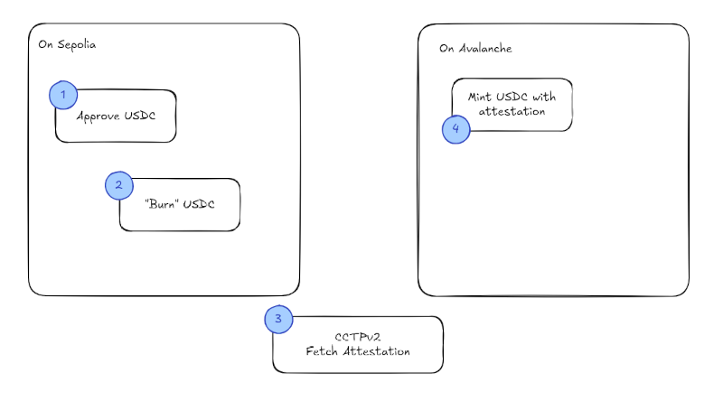

# CrossDream - Let's simplify cross chain user experience

By using multiple chains, liquidity are fragmentation. If I want to send some USDC to someone, for instance on Polygon, I may need to bridge my assets from different chains as my USDC are on Base, Arbitrum, Scroll...

This behavior is for USDC, but also all the other tokens we have. Why not simplify our journey by simplifying tokens transfer and asset management. This is the promise of CrossDream.

CrossDream is your platform to monitor and manage your assets through different chains. By leveraging 1Inch Fusion and Circle CCTPv2 we allow you the possibility to monitor, manage and transfert your assets easily.

### Technologies

On the frontend side, we are using Next.js and rainbowkit for the wallet connection. To monitor portfolio, we are using 1Inch Fusion API, allowing us to fetch user balance, tokens balance on different chains... And for the transfer of USDC, we are using Circle by leveraging their CCTPv2 technology allowing us to transfer easily USDC from one chain to another.

### How does the bridging works

For the USDC bridging, we are relying on CCTPv2. The idea is to burn on one side the USDC to be able to mint them on the targetted chain. For that, we first need to first approve the transfer of our USDC to the "token messager". Once approved, we can called the "burn" function from it, which will take our fund. 
Then, we will request from the circle an attestation allowing us to get a proof. This proof will be use when requesting the fund on the other chain allow us to prove that we have burn on the previous chain the fund. 
Here a diagram recapitulating the different steps.

